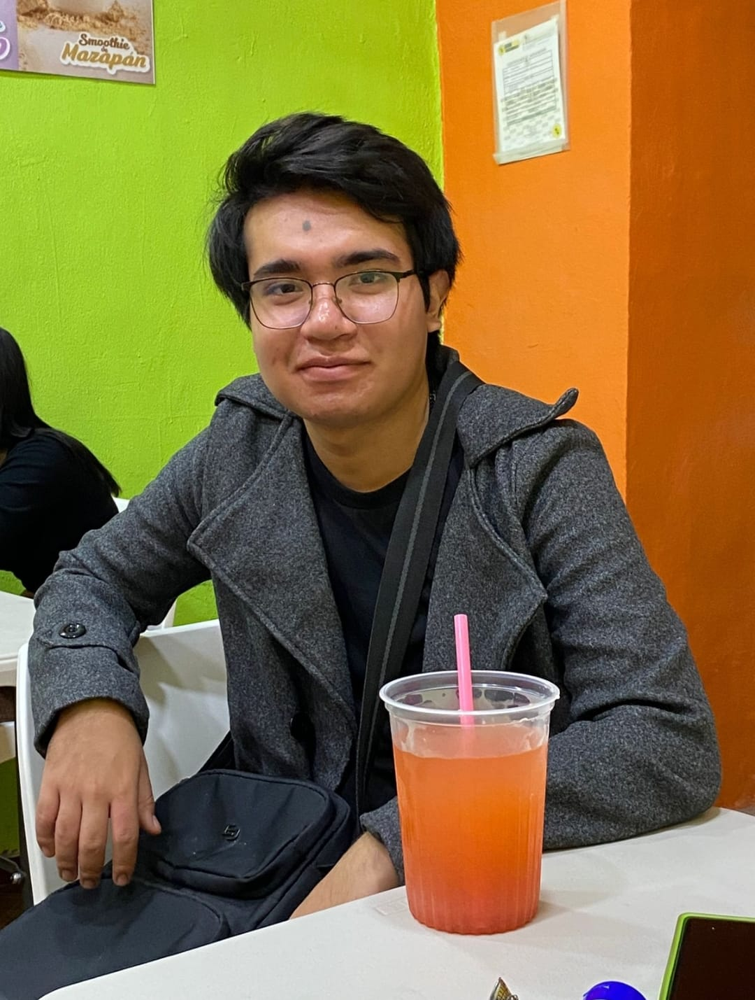
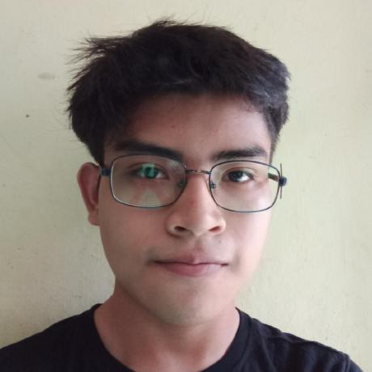
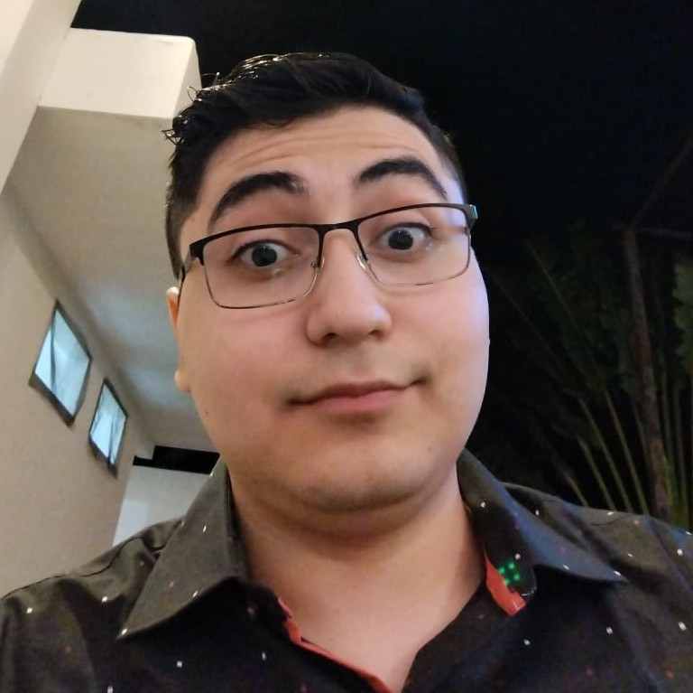

# proyecto-daw-2025
Proyecto final de la materia Desarrollo de Aplicaciones Web 2025.

| NOMBRES                     | FOTO                                                                                          | DESCRIPCION                                                                                                                                                             | LINKEDIN                                                                |
| --------------------------- | --------------------------------------------------------------------------------------------- | ----------------------------------------------------------------------------------------------------------------------------------------------------------------------- | ----------------------------------------------------------------------- |
| Greco Alejandro Gachuz Piña |  | Me gusta aprender y participar en diversos proyectos, eventos y competencias sobre tecnología, actualmente estoy especialmente interesado en el área de Ciberseguridad. | https://www.linkedin.com/in/greco-gachuz/ |
| Rodrigo Joaquín Pacab Canul |                                                      | Aprendo mejor con la práctica, es por eso que me gusta crear con propósito, creer y esperar que lo que hago ayudó a alguien en alguna parte del mundo.                  | https://www.linkedin.com/in/rodrigo-pacab/                              |
|Marcos Osorio Rodrigues Piña |  | Fanático de la tecnología y del desarrollo de sfotware. Me gusta participar en proyectos y comunicar mis ideas a las personas. | https://www.linkedin.com/in/marcos-osorio-rodrigues-piña-0b9a59289/ |

## Navegación entre entregas

- [Entrega 1](../Entrega-1/)
- [Entrega 2](../Entrega-2/)
- [Entrega 3](../Entrega-3/)

